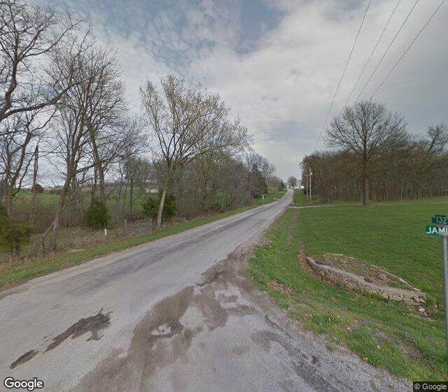
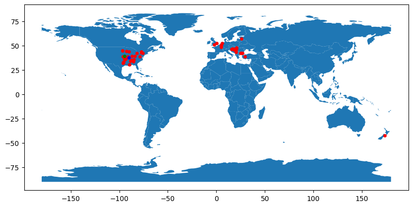

# GeoGuessr ML Competition

## Introduction

Geoguessr is a game where you are dropped in a random location in the world and you have to guess where you are. You can move around and look for clues to help you guess. The closer you are to the actual location, the more points you get.

In this Kaggle challenge, we are given a training set of images along with their GPS location, 
and we have to predict the location of the test set images.

The challenge can be found [here](https://www.kaggle.com/competitions/image-geo-localisation-geoguessr-bot).

## Demo



The model output for the above image is: 


The green dot corresponds to the actual location, and the red dot corresponds to the nearest neighbors
in the training set. The blue dot is the aggregated location computed from the neighbor locations.

## Installation

To run the code, you need to install the following packages:
```bash
pip install -r requirements.txt
```

## Data
The test data is available on the Kaggle challenge page. 
The training data will be made available publicly soon !

## Usage

Refer to the [notebook](Geoguessr.ipynb) for the code.

For the moment, the prediction strategy is very naive. 
We compute image embeddings using Meta's DinoV2 small model, and then we find the nearest neighbors in the training set.
We compute the final prediction by taking the geometric median of the K nearest neighbors.

This is the base strategy, and the goal is to slowly work up towards a more capable model.
A geoguessr score of 14000 can be expected on the World map, in the no moving, no zooming, no panning mode. 
